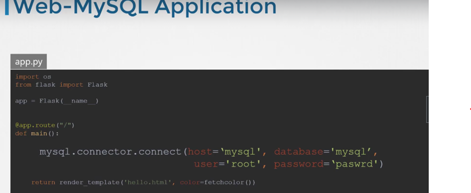

# Configure Environment Variables in Applications

## Secrets

<figure><figcaption></figcaption></figure>

위와 같이 DB 연결 정보를 하드코딩 해 놓는 건 좋은 생각이 아니다.&#x20;

ConfigMap으로 이런 정보들을 등록해 놓을 수 있지만, ConfigMap은 일반 text 형식으로 데이터를 저장하기 때문에 password를 저장해 놓기에는 적절하지 않다.&#x20;


민감 정보들을 저장하기 위해 인코딩 된 형식으로 환경변수를 저장할 수 있는 Secret 리소스가 존재한다.


### Create Secret (Imperative way)

리터럴로 생성

**`kubectl create secret generic app-secret –from-literal=DB_HOST=mys`` `**<mark style="color:blue;">**`# <secret-name> --from-literal=<key>=<value>`**</mark>

파일로 생성

**`kubectl create secret generic app-secret –from-file=app_secret.properties`` `**<mark style="color:blue;">**`# <secret-name> --from-file=<path-to-file>`**</mark>


### Create Secret (Declarative way)

`kubectl create -f secret-data.yaml`

```yaml
apiVersion: v1
kind: Secret
metadata:
    name: app-secret
data:
    DB_HOST: mysql
    DB_USER: root
    DB_PASSWORD: paswrd
```

위처럼 데이터를 일반 텍스트로 명시하면 아주 안전하진 않다. 인코딩된 형식으로 데이터를 저장해야 한다.

```yaml
apiVersion: v1
kind: Secret
metadata:
    name: app-secret
data:
    DB_HOST: bXlzcWw=
    DB_USER: cm9vdA==
    DB_PASSWORD: cGFzd3Jk
```


#### Converting to Encoded data (base64)

```bash
# Encode
echo -n 'mysql' | base64
# Decode
echo -n 'bXlzcWw=' | base64 -d # --decode
```


#### Check Secrets

**`kubectl get secrets`**

<figure><figcaption></figcaption></figure>

Default-token-\*: 쿠버네티스가 내부 목적으로 만들어놓은 Secrets


**`kubectl describe secrets`**

<figure><figcaption></figcaption></figure>

yaml 파일 보려면

`kubectl get secret <secret-name> -o yaml`


### Inject into POD

<figure><figcaption></figcaption></figure>

<figure><figcaption></figcaption></figure>

환경변수(envFrom)로 주입할 수 있고

단일 환경 변수로 넣을 수도 있고

파일로서 전체 Secrets을 볼륨에 넣을 수도 있다.

\--> Volume? Pod안에 Secret을 볼륨으로 마운트한다는 것은, Secret 각각의 configuration들이 파일로 각각 생성된다는 것이다.\


<figure><figcaption></figcaption></figure>


### Note on Secrets

1. **Secrets는 Encoded 데이터이지 Encrypted 데이터가 아니다.**
   1. Secret object를 git ignore 해 놓기


2. **Secrets 데이터는 ETCD에 암호화되어 있지 않다.**
   1. ETCD의 어떤 데이터도 default로 암호화되지 않는다.
   2. ETCD의 기밀 데이터를 암호화 가능
      1. kind: EncryptionConfiguration --> kube-apiserver에 옵션으로 comand에 추가해서 통과시킬 수 있다. 특정 리소스만 암호화할 수 있음
      2. [Encrypting Confidential Data at Rest | Kubernetes](https://kubernetes.io/docs/tasks/administer-cluster/encrypt-data/)

&#x20;

3. **같은 namespace에서 Pod/Deployments를 만들거나 배포할 수 있는 모든 사람들이 다 Secrets에 접근할 수 있다.**
   1. 역할 기반 액세스 제어를 구성해 액세스 제한 가능
      1. Configure least-privilege access to Secrets – RBAC
      2. [https://kubernetes.io/docs/concepts/security/rbac-good-practices/](https://kubernetes.io/docs/concepts/security/rbac-good-practices/)

&#x20;

4. **Third-party Secrets Providers를 고려하자.**
   1. AWS, Azure, GCP, Vault Provider 등…
   2. 이러면 Secrets가 ETCD가 아니라 외부 Secret Provider에 저장되고 Providers는 보안의 대부분을 처리하게 된다.


k8s에서 Secret의 보안 기능에 대해서는 약간 혼란스럽다. k8s document 페이지와 많은 블로그에서는 Secret을 민감한 데이터를 저장하는 "safer option" 이라고 언급한다. 물론 일반 text 로 저장하는 것보다는 훨씬 민감 정보 노출 위험을 줄이지만, 이는 인코딩된 데이터일 뿐 암호화된 것은 아니다.

강사는 "safer option"이라는 것은 Secret 그 자체가 아니라 Secret을 사용하는 관행 때문일 거라고 말한다. 뿐만 아니라 k8s가 Secret을 처리하는 방식 자체 때문일 거라고 말한다.


best practicies

* Secret 개체 정의 파일을 소스 코드 저장소에 check-in 하지 않음
* Secret 정보가 ETCD에 암호화되어 저장되도록 "Encryption at Rest" 활성화

k8s handles secrets

* 해당 노드의 Pod에서 필요한 경우에만 Secret이 해당 노드로 전송됨
* kubelet은 Secret이 디스크 저장소에 기록되지 않도록 Secret을 "tmpfs"에 저장함
* Secret에 의존하는 Pod가 삭제되면 kubelet은 Secret data의 로컬 복사본도 삭제


Read about the [protections ](https://kubernetes.io/docs/concepts/configuration/secret/#protections)and [risks](https://kubernetes.io/docs/concepts/configuration/secret/#risks) of using secrets [here](https://kubernetes.io/docs/concepts/configuration/secret/#risks)

Having said that, there are other better ways of handling sensitive data like passwords in Kubernetes, such as using tools like Helm Secrets, [HashiCorp Vault](https://www.vaultproject.io/). I hope to make a lecture on these in the future.


